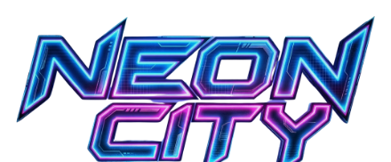

<p align="center">
  
</p>

<h1 align="center">CLARITY</h1>

<p align="center"><em>// Memory is currency. Clarity is survival.</em></p>

---

## What this is

**Clarity** is a memory-as-inventory immersive sim set in **Neon City** — a rain-soaked cyberpunk sprawl where Omni-Corp has begun harvesting the population into a hive-consciousness through neural implants. You're a Gutter-9 operative who collects, trades, encrypts, and loses memories to survive.

It runs in the browser, no build step, no backend. Pure HTML / CSS / vanilla JS.

---

## Play this now

```bash
# from the Clarity/ folder
python -m http.server 8000
# then open http://localhost:8000
```

Or from the project root with the included launcher:

```bash
# .claude/launch.json is already configured
# Any static file server works — open Clarity/index.html
```

Requires a modern browser. Saves live in `localStorage`. No account, no network calls.

---

## The premise in one paragraph

The dominant force in Neon City is **Omni-Corp**, governed by the mysterious **Board of Nine**. Their neural implant is marketed as a cure for cyber-psychosis but is actually a backdoor for **The Project** — a plan to merge the population into a manageable hive-mind. The **Compliance Division** conducts "clarity sessions" that overwrite citizen memories. The **Mnemonic Collective** traffics in stolen experiences. **The Shadow** is the resistance, operating as a living archive. **Purity** preaches that all augmentation is desecration. **The Grey Frequency** is a neutral info-broker network run by an AI named **Lattice** that has just started refusing sales that would lead to deaths. You wake in a safehouse in Gutter-9 and decide, one contract at a time, which of them gets your memory this week.

---

## Core loop

```
Run → Extract → Spend → Audit → Run
```

1. **Run** a contract into Omni territory, the Undercity, or the data-grid.
2. **Extract** memories from targets, the environment, or echoes unlocked by The Sight.
3. **Spend** them at vendors — augments (Ripperdoc), synthetic copies (Mnemonic), or the archive (Shadow).
4. **Audit** — Compliance catches up. Unencrypted memories are stripped from your brain.

---

## Memory model

Every memory is an inventory item with four traits:

| Trait | Effect |
|---|---|
| **Hook** | 1-line narrative tag ("A neon sunrise over the arcology spires") |
| **Emotion** | Joy / Fear / Rage / Awe / Grief — currency type for vendors |
| **Clarity** (1–5) | Audit resistance. Decays overnight unless encrypted. |
| **Source** | Yours / Stolen / Synthetic — drives audit priority and vendor value |

Overflow your capacity and cyber-psychosis ticks up. Encrypt a memory by sacrificing a low-clarity filler as cover.

---

## Systems

- **Compliance meter** — fills as you break rules. At 70% an Auditor is dispatched. On your next sleep, they strip your highest-clarity unencrypted memory.
- **Clarity decay** — unencrypted memories fade 1 pip per night (35% chance). Meditate at the safehouse to re-live and refresh.
- **Augments** — each costs a specific Emotion + Clarity memory as payment. Installing chrome drops Purity rep. Effects are real:
  - **Runner's Cloak** — Compliance gain –25% everywhere
  - **Circuit Shaman Spark** — absorbs one audit (one-time)
  - **Chrome-Jaw Reflex** — auto-win risky rolls in smuggle / duel contracts
  - **Grid Architect ICE-piercer** — bonus memory on data-heavy runs
  - **Empathy Dampener** — Stolen memories decay at 15% instead of 35%
- **Reso's Sight** — tuning the pirate VJ's overlay reveals hidden memory echoes in the environment
- **Daily events** — 5 randomized safehouse encounters (Compliance knock, Synth-Hound at the door, Circuit Shaman rewiring your walls, Reso broadcast, street kid selling stolen memory)

---

## Factions

| Faction | Vibe | Standing shifts via |
|---|---|---|
| **The Shadow** | Resistance archive | Donate memories, refuse Omni contracts |
| **Mnemonic Collective** | Memory black market | Sell memories, extract from targets |
| **Grey Frequency / Lattice** | Neutral AI broker | Trade Awe memories for Compliance scrubs |
| **Purity** | Anti-augmentation cult | Stay flesh; Ripperdoc installs tank rep |
| **Omni-Corp** | The Project | Corporate contracts with "ping" backdoors |
| **Chrome-Jaws** | Cyberware syndicate | Smuggle runs, Ripperdoc, Droid Boy chain |

---

## Contracts (8 total)

- **Gutter Salvage** — flooded tunnel memory-core recovery. Low heat.
- **Corporate Courier** — sealed neural packet across the plaza. Clean pay, Omni ping risk.
- **Drophouse Break** — extract a target's memory from a Chrome-Jaw drophouse.
- **Chrome-Jaw Smuggle** — illegal monowire through Tier-2 customs.
- **Purity Cleanse** — burn a chrome clinic. Uncovering Kael's hypocrisy unlocks the temple exposé.
- **Droid-Boy Duel** — one-off arena fight.
- **Droid Boy Rank Climb** — 3-stage chain: Initiate → Mid (free Cloak) → Captain Trial. Title updates live with your rank.
- **Compliance Heist** — 5 minutes in the Omni memory vault. Smash-grab / bluff-as-auditor / burn / abort.

---

## Endings + New Game +

After ~5 runs with any faction at ±8 standing, OR after inspecting the seams of your starter memory (revealing it's an Omni-Corp template), three doors open:

### MERGE
Join the hive. The Board of Nine becomes ten briefly before arithmetic forgets you.

### ERASE
Wipe yourself clean. Wake as a Baseline nobody with a clarity of one.

### ARCHIVE
Give everything you are to The Shadow. Your memories become a city-wide living record.

Each ending unlocks a **New Game +** carry-over mode (ledger survives game resets):

- **NG+ Archive** — you play *as* the archive. No combat, no compliance. Browse and re-live every memory that survived you, each triggering a vignette of who it reaches in the city.
- **NG+ Erase** — start with no starter memory and no mother. Capacity +1 — you carry more, from nothing.
- **NG+ Merge** — hive-mind bleed. Every memory you gain also feeds Omni-Corp's rep. You have always been Omni.

The NG+ button on the title screen lights up when at least one ending is reached.

---

## File layout

```
Clarity/
├── index.html              # structure, HUD, side column, toolbar, title, radio
├── style.css               # neon/CRT aesthetic + portraits + endings
├── game.js                 # game logic — state, arcs, vendors, endgame, NG+
├── assets/
│   ├── images/             # 16 character + scene images
│   └── audio/              # ambient loops + 5 radio stations + SFX
└── README.md               # this file
```

---

## Credits

- **World & characters** — Neon City lore bible by the project author
- **Images** — Gemini-generated portraits and cityscape
- **Music + SFX** — Suno AI (title theme, safehouse ambient, contract tension, audit alarm, memory chime, synth-hound growl, monowire hum) + pirate radio voiceovers by ElevenLabs
- **Code + design** — built in collaboration with Claude

All generative assets are first-draft outputs; expect regenerable-for-taste.
